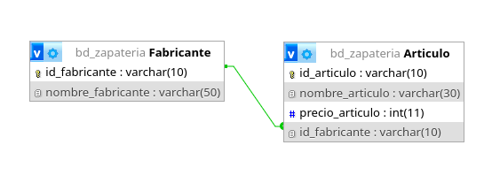
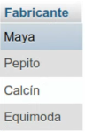
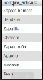
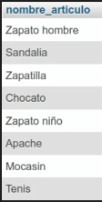

# Sistemas para una zapatería

## Modelo Entidad-Relación

 

 ## Modelo físico de la BD

 

## Consultas a la BD

1. Mostrar la lista de todos los fabricantes

    `SELECT * FROM Fabricante;`

2. Mostrar la lista de nombres de los fabricantes

    `SELECT nombre_fabricante FROM fabricante`

    

3. Mostrar los nombres de los productos.

    `SELECT nombre`

    

4. Obtener los nombres y los precios de los productos de la tienda.

    `SELECT nombre_articulo AS Nombre, precio_articulo AS Precio FROM Articulo;`

    

5. Obtener los nombres de los arttículos cuyo precio sea superior a 50000

    `SELECT nombre_articulo FROM Atículo WHERE precio articulo < 50000;`

     

6. Obtener el nombre de los artículos cuyo precio este entre 5000 y 40000 (ambos incluidos)

    ### Forma 1
    `SELECT nombre articulo FROM Artículo WHERE precio_artículo BETWEEN 5000 AND 40000;`

    ### Forma 2 
    `SELECT nombre_artículo FROM Artículo WHERE precio artículo BETWEEN 5000 AND 40000;`

    

7. obtener el nombre y el precio en dolares de todos los articulos

    Obtener el nombre y el precio en dólares de todos los artículos
    Supongamos que tienes una tabla llamada articulos con las columnas nombre, precio (en moneda local), y la tasa de conversión de tu moneda a dólares es 1 USD = X unidades de tu moneda local. 

Consulta:sql
`SELECT nombre, (precio / X) AS precio_en_dolares
FROM articulos;Donde X es el valor de la tasa de conversión a dólares;`

8. Calcular el precio promedio de todos los articulos

    sql
    SELECT AVG(precio) AS precio_promedio
    FROM articulos;

9. Obtener el precio promedio de los articulos cuyo id del frabricante sea fab02

    sql
SELECT AVG(precio) AS precio_promedio_fab02
FROM articulos
WHERE id_fabricante = 'fab02';

10. Obtener el numero de articulos cuyo precio sea mayor o igual a 50000

    `sql
SELECT COUNT(*) AS cantidad_articulos
FROM articulos
WHERE precio >= 50000;`